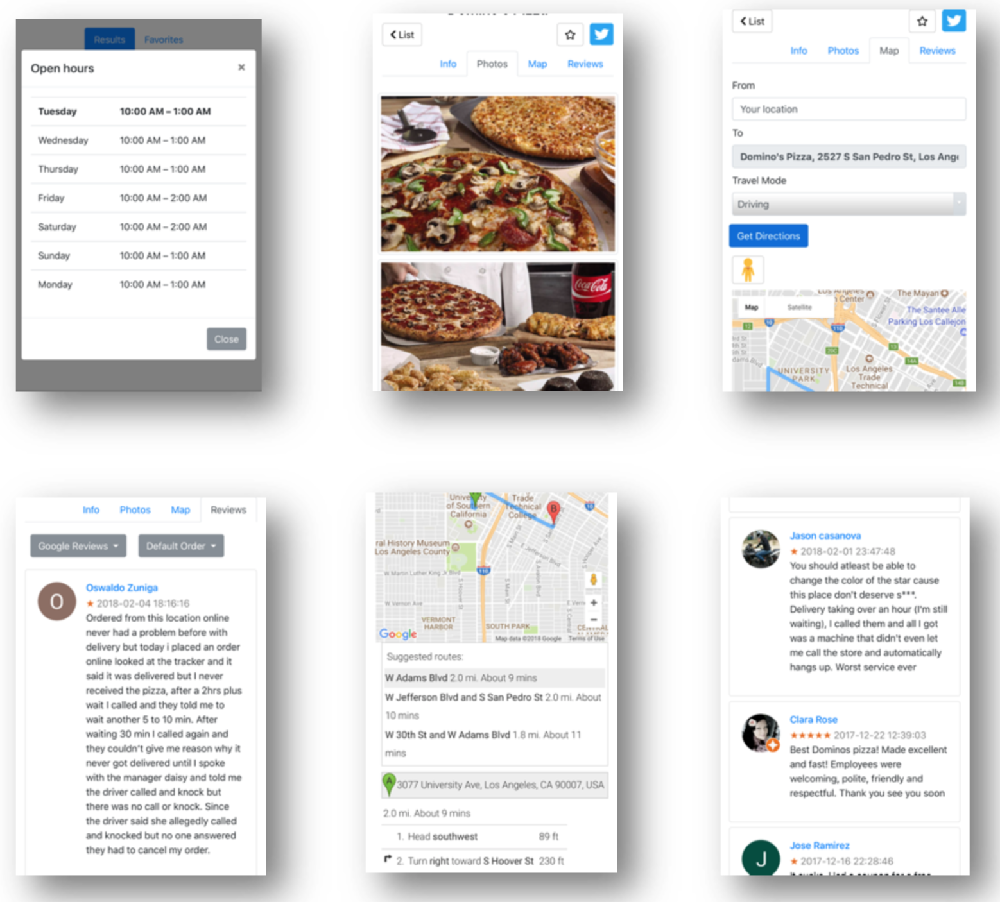
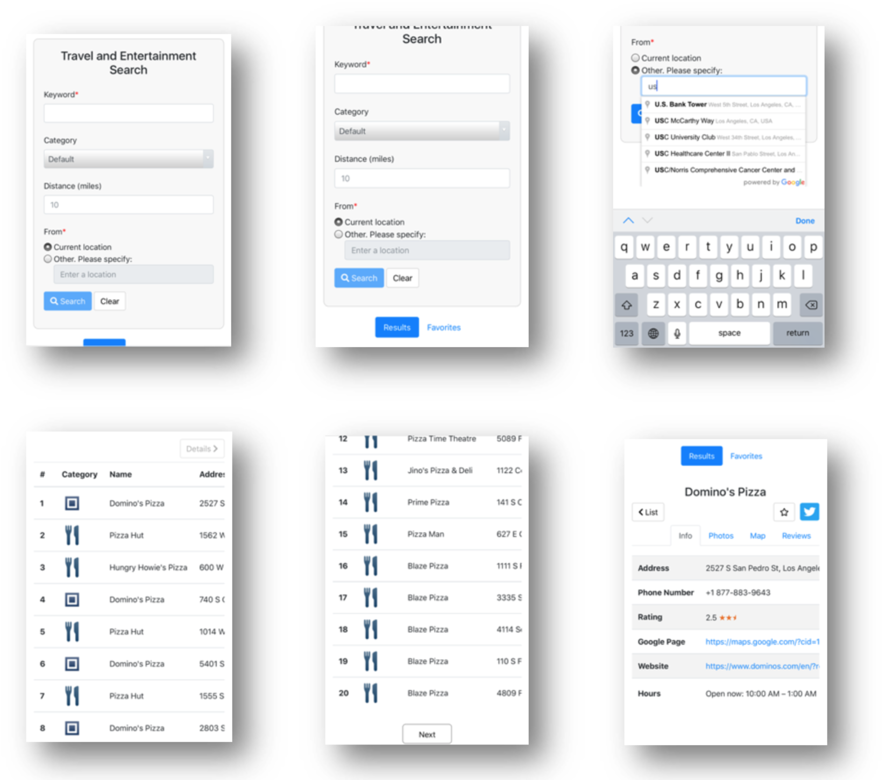
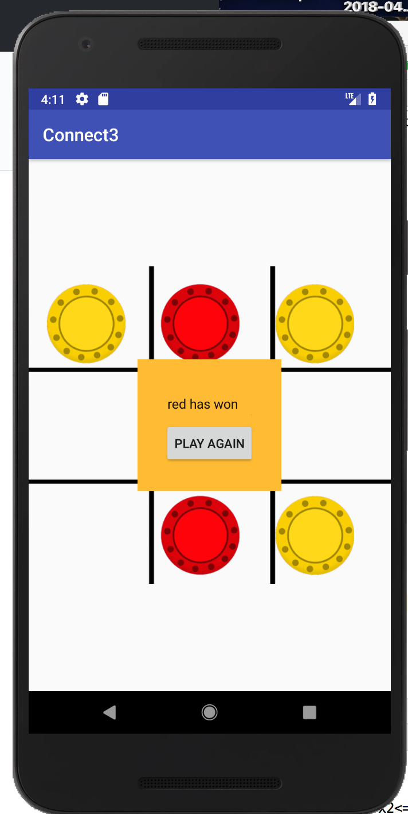
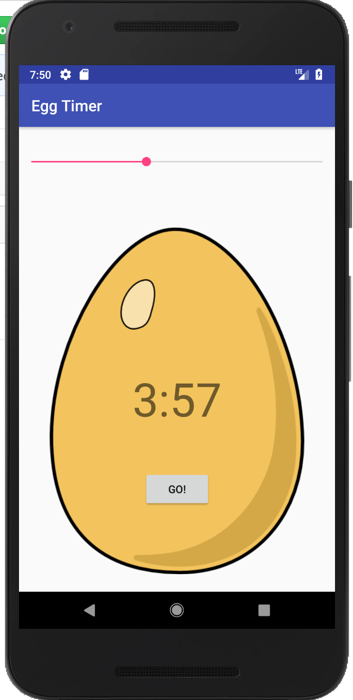
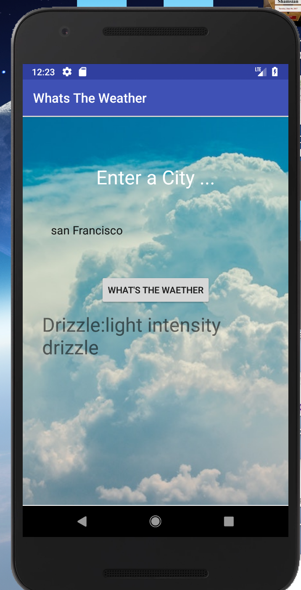
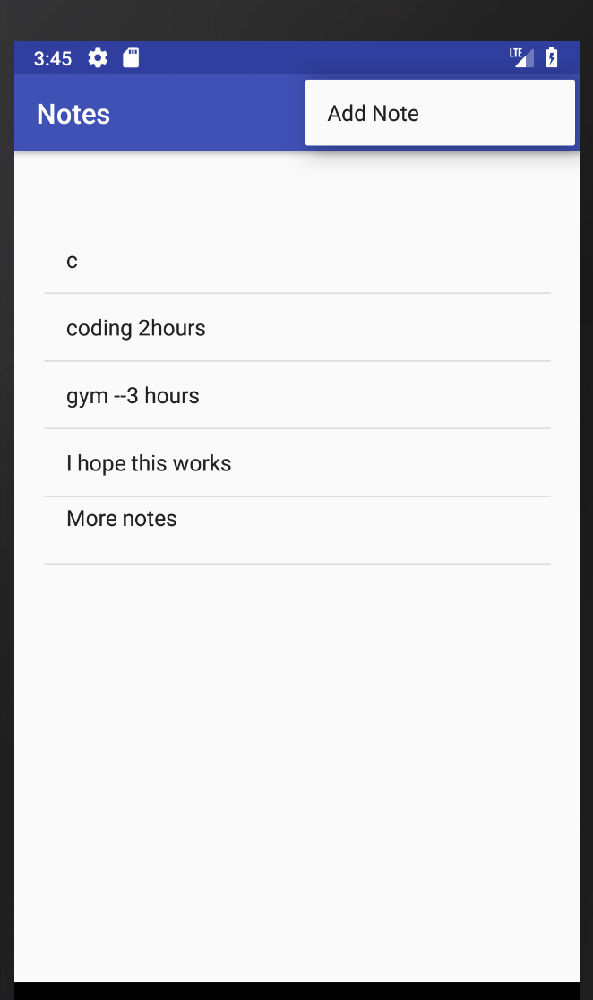
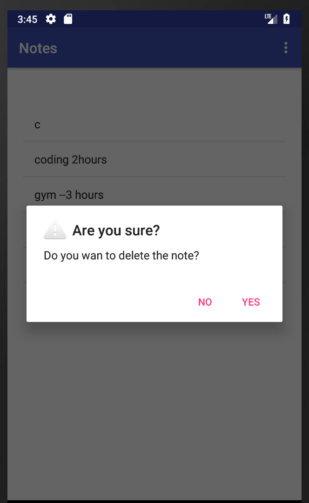

# Android

Latest: Locaiton Search
front-end: Java, Android SDK
backend: Node.js, Express

1. Connect 3 - A tic tac toe game on Android

2. Egg Timer - A countdown timer on Android

3. Weather App - using OpenWeatherApp API

4. Notes -- A simple notes taker. Add new notes, delete notes, save notes(SharePreferences)

 Delete a notes 

